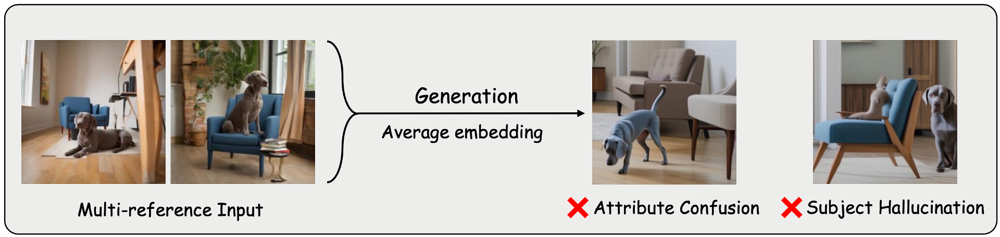

    
     
    <em>Figure1: Visualizations on DreamBench.</em>

    
     
    <em>Figure2: More failure cases.</em>

    
     
    <em>Figure3: Facial preservation results.</em>

    
     
    <em>Figure4: Multi-subject preservation.</em>

    
     
    <em>Figure5: Comparison between EasyRef and Kosmos-G.</em>

